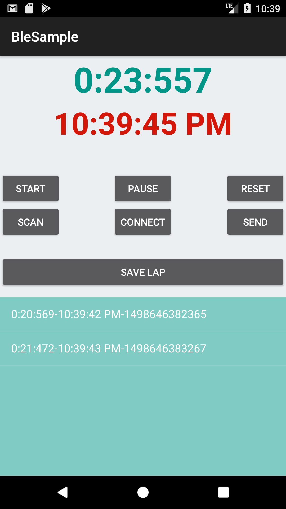

# BluetoothTiming

This is the tool to test time latency when sending timestamp to the remote bluetooth module in Ardunio board. Time received is captured by Putty terminal. https://www.chiark.greenend.org.uk/~sgtatham/putty/latest.html

